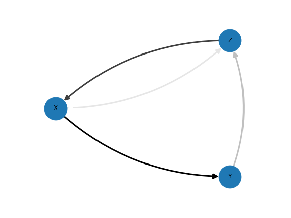
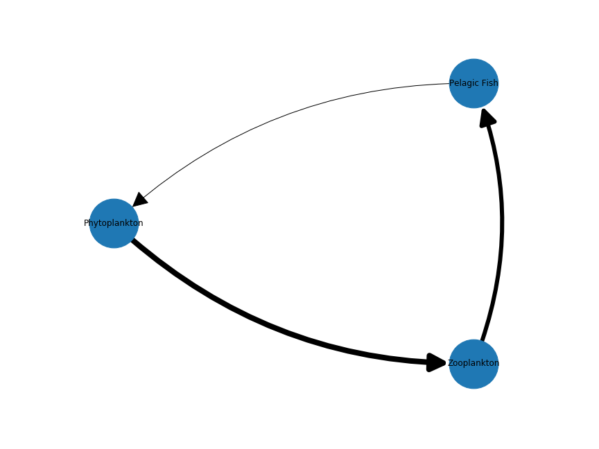
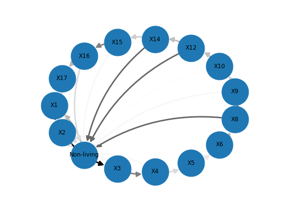
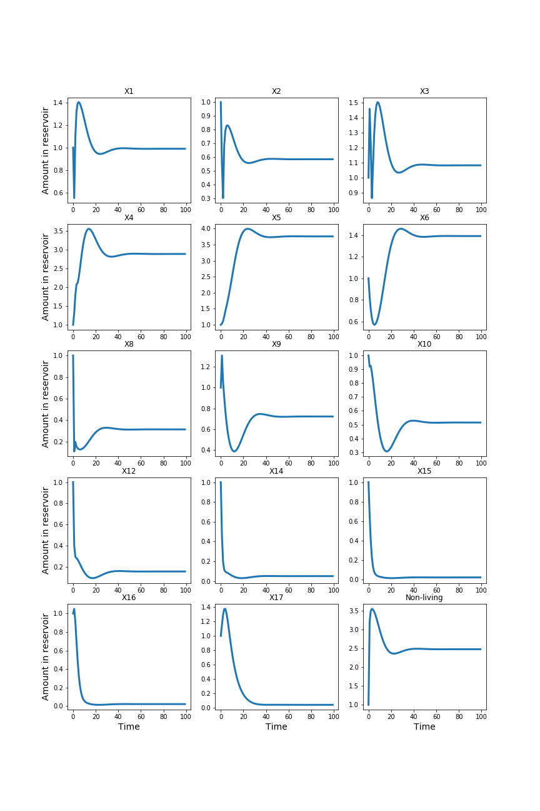

# Ocean Biological Network Simulation

 This project aims to apply compuational tools (network, simulation,...) to mimic oceanography biological system. Our simulation allows us to predict system's dynamics in the given scenario (such as spring blooms). 

## STEP 0: TOY MODEL

  

  

## STEP 1: REPLICATE PAPER
The first task of this project is to replicate this paper: https://link.springer.com/content/pdf/10.1007/BF00392763.pdf 
The tasks in this step: 
- Adjust the network (from the toy model) to represent the reservoirs and fluxes from the paper

  

- Find a way to add the parameters of the paper to the network -> MARKOV CHAIN!
- Simulate the network and visualize the results (similar to the graphs from the paper)

  

## STEP 2: ADJUST THE PARAMETERS OF THE MODEL
